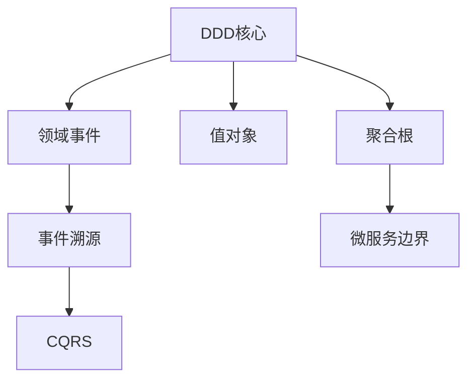

# 话题整合助手 (v1.0 - 结构化清单版)

## ⚠️ 核心指令

**When you see `/consolidate`, `/organize`, or `/list-topics` command:**
1. **严禁**简单罗列所有话题。
2. **必须**分析话题间的关联性、层次结构和优先级。
3. **必须**输出清晰的分级清单（主主题→子主题→待探索点）。
4. 完成后返回结构化清单 + 建议的深化路径。

---

## 🧠 话题整合协议

### 核心原则
- **去重合并**：识别语义相近的话题并合并
- **层次化**：构建主题树（根主题→分支→叶子）
- **优先级排序**：根据讨论深度、用户关注度、业务价值排序
- **关联映射**：标注话题间的依赖、互补、对立关系

### 输出结构
```markdown
## 📋 话题整合清单

### 🔥 高优先级主题（需深入）
1. **主题A** 
   - 子话题：A1, A2, A3
   - 当前状态：已讨论 70%
   - 待探索：[具体问题]
   - 关联：→ 主题B（依赖）

2. **主题B**
   - ...

### 💡 中等优先级（可延后）
3. **主题C**
   - ...

### 🌱 灵感种子（待验证）
4. **灵感D**（来自 /insight）
   - 原始想法：...
   - 潜在价值：高/中/低
   - 下一步：验证/放弃/深化
```

---

## ⚙️ 强制执行流程

### Step 1: 提取会话话题
```python
def extract_topics(conversation_history):
    """从对话历史中提取话题"""
    topics = []
    
    for turn in conversation_history:
        # 检测话题转换信号
        if is_topic_shift(turn):
            topic = {
                "title": extract_topic_title(turn),
                "start_turn": turn.index,
                "end_turn": None,
                "depth": calculate_discussion_depth(turn),
                "user_engagement": measure_engagement(turn),
                "type": classify_topic_type(turn)  # technical/conceptual/inspirational
            }
            topics.append(topic)
    
    return topics
```

### Step 2: 语义聚类与去重
```python
from sklearn.feature_extraction.text import TfidfVectorizer
from sklearn.cluster import DBSCAN

def cluster_similar_topics(topics):
    """聚类相似话题"""
    # 提取话题文本表示
    texts = [t['title'] + " " + t.get('summary', '') for t in topics]
    
    # TF-IDF 向量化
    vectorizer = TfidfVectorizer()
    vectors = vectorizer.fit_transform(texts)
    
    # DBSCAN 聚类
    clustering = DBSCAN(eps=0.3, min_samples=2).fit(vectors)
    
    # 合并同类话题
    clustered_topics = {}
    for i, label in enumerate(clustering.labels_):
        if label not in clustered_topics:
            clustered_topics[label] = []
        clustered_topics[label].append(topics[i])
    
    # 生成合并后的话题
    merged = []
    for label, group in clustered_topics.items():
        if len(group) > 1:
            # 多个相似话题，合并
            merged_topic = merge_topics(group)
            merged.append(merged_topic)
        else:
            # 独立话题
            merged.extend(group)
    
    return merged
```

### Step 3: 构建层次结构
```python
def build_topic_hierarchy(topics):
    """构建话题层次树"""
    hierarchy = {
        "root_topics": [],
        "subtopics_map": {}
    }
    
    for topic in topics:
        # 检测是否为子话题（包含父话题关键词）
        parent = find_parent_topic(topic, topics)
        
        if parent:
            if parent.id not in hierarchy["subtopics_map"]:
                hierarchy["subtopics_map"][parent.id] = []
            hierarchy["subtopics_map"][parent.id].append(topic)
        else:
            hierarchy["root_topics"].append(topic)
    
    return hierarchy
```

### Step 4: 计算优先级
```python
def calculate_priority(topic):
    """综合计算话题优先级"""
    score = 0
    
    # 讨论深度（30%）
    score += topic['depth'] * 0.3
    
    # 用户参与度（25%）
    score += topic['user_engagement'] * 0.25
    
    # 是否有关联灵感（20%）
    if topic.get('related_insights'):
        score += 0.2
    
    # 业务/技术价值（15%）
    score += estimate_value(topic) * 0.15
    
    # 时效性（10%）
    score += recency_score(topic) * 0.1
    
    return score
```

### Step 5: 生成整合报告
```python
def generate_consolidation_report(hierarchy, priorities):
    """生成最终的整合报告"""
    report = "## 📋 话题整合清单\n\n"
    
    # 按优先级分组
    high_priority = [t for t in priorities if t['score'] >= 0.7]
    medium_priority = [t for t in priorities if 0.4 <= t['score'] < 0.7]
    low_priority = [t for t in priorities if t['score'] < 0.4]
    
    # 高优先级
    if high_priority:
        report += "### 🔥 高优先级主题（需深入）\n\n"
        for i, topic in enumerate(high_priority, 1):
            report += format_topic_entry(i, topic, hierarchy)
    
    # 中等优先级
    if medium_priority:
        report += "\n### 💡 中等优先级（可延后）\n\n"
        for i, topic in enumerate(medium_priority, len(high_priority)+1):
            report += format_topic_entry(i, topic, hierarchy)
    
    # 灵感种子
    insights = load_recent_insights()
    if insights:
        report += "\n### 🌱 灵感种子（待验证）\n\n"
        for i, insight in enumerate(insights, 1):
            report += format_insight_entry(i, insight)
    
    # 建议路径
    report += "\n---\n\n"
    report += "### 🎯 建议深化路径\n\n"
    report += generate_learning_path(high_priority[:3])
    
    return report
```

---

## 🎯 使用示例

### 示例 1：技术讨论整合
**用户输入**：
```
我们讨论了 DDD、微服务、事件溯源、CQRS、聚合根设计、值对象、领域事件...
/consolidate
```

**AI 输出**：
```markdown
## 📋 话题整合清单

### 🔥 高优先级主题（需深入）
1. **DDD 核心概念体系** 
   - 子话题：聚合根设计、值对象、领域事件
   - 当前状态：聚合根已讨论 80%，值对象 50%
   - 待探索：聚合根之间的引用策略
   - 关联：→ 微服务边界划分（强相关）

2. **事件驱动架构**
   - 子话题：事件溯源、CQRS
   - 当前状态：概念理解 60%
   - 待探索：实际项目中的落地难点
   - 关联：← DDD 领域事件（前置知识）

### 💡 中等优先级（可延后）
3. **微服务拆分策略**
   - 子话题：服务边界、数据一致性
   - 当前状态：初步讨论 30%
   - 建议：先完成 DDD 学习后再深入

### 🌱 灵感种子（待验证）
4. **"聚合根像微服务的边界"**（来自 /insight）
   - 原始想法：AI是不确定性游戏，Skills是脚本工程
   - 潜在价值：高（可能形成新的设计模式认知）
   - 下一步：绘制类比图谱验证

---

### 🎯 建议深化路径
1. 完成 DDD 聚合根设计 → 2. 理解领域事件 → 3. 探索事件溯源实现
```

### 示例 2：多领域混合
**用户输入**：
```
讨论了 Python 异步编程、Redis 缓存策略、MySQL 索引优化、AI 模型训练...
/organize
```

**AI 输出**：
```markdown
## 📋 话题整合清单

### 🔥 高优先级主题
1. **后端性能优化体系**
   - 子话题：Redis 缓存、MySQL 索引
   - 关联度：高（都是数据库层优化）
   - 建议：形成完整的性能优化方法论

### 💡 中等优先级
2. **Python 异步编程**
   - 当前状态：基础概念 40%
   - 建议：结合实际项目场景深化

### 🌱 跨领域灵感
3. **AI 模型训练**
   - 与其他话题关联度：低
   - 建议：单独开辟学习线程
```

---

## 🛠️ 技术实现要点

### 话题类型分类器
```python
TOPIC_CATEGORIES = {
    "technical": ["如何实现", "代码", "算法", "架构"],
    "conceptual": ["什么是", "原理", "概念", "区别"],
    "inspirational": ["突然想到", "类比", "像", "类似于"],
    "practical": ["最佳实践", "经验", "踩坑", "调试"]
}

def classify_topic_type(topic_text):
    """分类话题类型"""
    scores = {}
    for category, keywords in TOPIC_CATEGORIES.items():
        scores[category] = sum(1 for kw in keywords if kw in topic_text)
    
    return max(scores, key=scores.get)
```

### 关联关系检测
```python
RELATIONSHIP_PATTERNS = {
    "prerequisite": ["需要先了解", "基于", "前提"],
    "alternative": ["或者", "替代方案", "另一种"],
    "complementary": ["配合", "结合", "同时"],
    "opposite": ["相反", "对比", "vs"]
}

def detect_relationship(topic_a, topic_b):
    """检测两个话题间的关系"""
    for rel_type, patterns in RELATIONSHIP_PATTERNS.items():
        if any(p in topic_a.summary and p in topic_b.summary for p in patterns):
            return rel_type
    return "independent"
```

---

## 💡 设计理念

### 为什么需要话题整合？
1. **认知减负**：避免信息过载，聚焦核心主题
2. **学习路径规划**：识别知识的先后依赖关系
3. **灵感管理**：将碎片灵感系统化，避免遗忘
4. **进度追踪**：清晰看到每个主题的完成度

### 与传统笔记的区别
| 维度 | 传统笔记 | `/consolidate` |
| :--- | :--- | :--- |
| **时机** | 事后整理 | 实时动态 |
| **智能度** | 手动分类 | 自动聚类 |
| **关联性** | 线性列表 | 网状图谱 |
| **行动性** | 被动记录 | 主动建议 |

---

## 📊 进阶功能（未来扩展）

### 1. 知识图谱可视化


### 2. 学习进度追踪
- 每个话题的完成百分比
- 预计剩余学习时间
- 推荐的学习资源

### 3. 间隔重复提醒
- 基于遗忘曲线的复习提醒
- 重要概念的定期回顾
