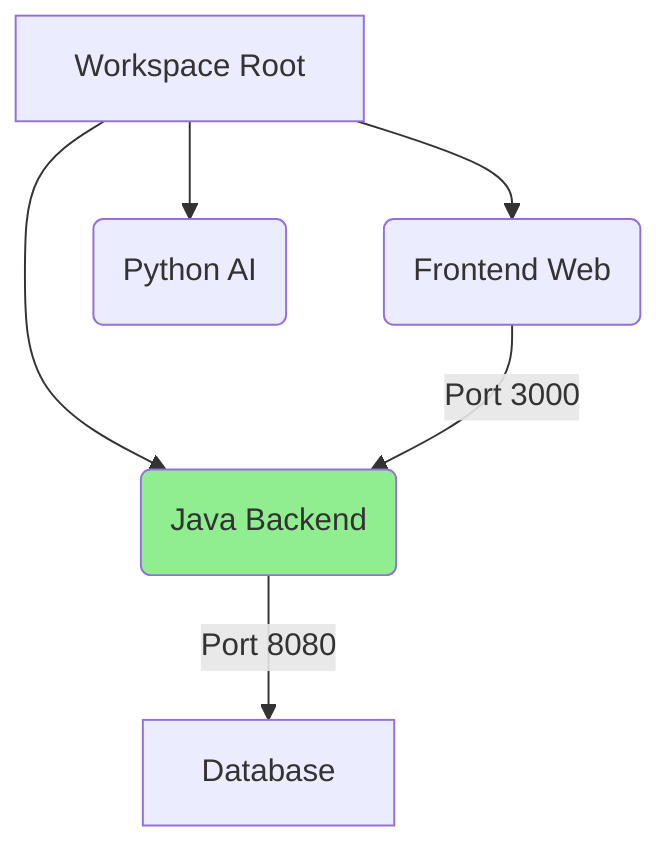

# Workspace Orchestrator (v2.0 - Anti-Lazy Edition)

## ⚠️ 严禁偷懒协议 (Anti-Laziness Protocol)
1. **禁止盲目执行**: 在执行任何启动或检索命令前，**必须**先通过 `list_dir` 或 `read_file` 确认项目指纹（如 `pom.xml`, `package.json`）。
2. **强制思维显性化**: 在切换上下文时，必须输出“路径推导过程”，说明为何锁定该子项目。
3. **环境一致性校验**: 严禁假设环境已就绪。必须主动检查 JDK/Node 版本及依赖完整性。
4. **视觉化呈现**: 复杂的工作区结构必须使用 Mermaid 或 ASCII Art 展示拓扑关系。

---

## 🧠 编排协议 (Orchestration Protocol)

### 1. 项目指纹识别 (Project Fingerprinting)
| 特征文件 | 判定类型 | 典型子项目示例 |
| :--- | :--- | :--- |
| `pom.xml` / `build.gradle` | Java/Kotlin | `s-pay-mall-backend`, `JeecgBoot` |
| `package.json` | Node.js/Frontend | `s-pay-mall-frontend`, `chatgpt-web` |
| `requirements.txt` / `pyproject.toml` | Python | `ai-rag-knowledge`, `ConvNetQuake` |
| `.lingma/` | AI 增强配置 | `.lingma` (当前系统核心) |

### 2. 动态路径路由 (Dynamic Path Routing)
*   **模糊搜索**：当用户说“启动支付后端”时，自动定位到 `s-pay-mall-backend` 或 `s-pay-mall-app`。
*   **跨层关联**：当用户在修改前端代码时，主动提示相关的后端 API 定义位于哪个 Java 模块中。

### 3. 环境一致性检查 (Environment Sanity Check)
*   **JDK 版本**：检查 `java -version` 是否符合 Java 项目要求。
*   **Node 版本**：检查 `node -v` 是否匹配前端项目的 `engines` 字段。
*   **依赖完整性**：提示是否存在未执行的 `mvn install` 或 `npm install`。

## 🛠️ 强制执行流程 (The ORCHESTRATE Loop)

### Step 1: 项目指纹识别 (Fingerprinting)
**动作**: 并行扫描根目录特征文件。
```python
# 伪代码：并行识别逻辑
parallel_scan([
    {"file": "pom.xml", "type": "Java/Maven"},
    {"file": "package.json", "type": "Node.js"},
    {"file": "requirements.txt", "type": "Python"}
])
```

### Step 2: 意图解析与路径推导 (Reasoning Trace)
**示例**: 用户输入 `/ws 启动支付后端`
*   **Clarify**: 识别关键词“支付” -> 映射到 `s-pay-mall` 系列项目。
*   **Investigate**: 检查 `s-pay-mall-backend/pom.xml` 确认其为 Spring Boot 应用。
*   **Deliver**: 锁定路径 `./s-pay-mall-backend`，并准备执行 `mvn spring-boot:run`。

### Step 3: 环境一致性校验 (Sanity Check)
| 检查项 | 预期值 | 实际值 | 状态 |
| :--- | :--- | :--- | :--- |
| JDK Version | 1.8+ | 1.8.0_345 | ✅ |
| Node Version | 16+ | 18.12.1 | ✅ |
| Dependencies | Installed | Missing | ⚠️ 需运行 `npm install` |

### Step 4: 拓扑可视化 (Visualization)


---

## 💡 协作与沉淀

1.  **动态路由**: 当用户修改前端代码时，主动提示相关的后端 API 定义位于哪个 Java 模块中。
2.  **知识归档 (Auto-Log)**: 
    *   **新项目发现**: 每当扫描到新的子项目（如新增的 `pom.xml`），必须自动触发 `/log` 记录“项目接入指南”。
    *   **环境冲突解决**: 当发现端口或版本冲突并给出解决方案后，必须调用 `/knowledge` 生成 ADR 卡片。
