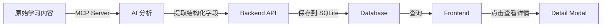

# Learning Log MCP Server

自动化学习记录捕获系统，通过 AI 分析学习内容并自动填充数据库。

## 📦 安装依赖

```bash
cd backend
pip install -r requirements.txt
cp .env.example .env
```

## ⚙️ 配置

编辑 `.env` 文件：

```env
# Backend Configuration
BACKEND_URL=http://localhost:8002

# AI Configuration (选择一种)

# 选项 1: Ollama (本地 LLM，推荐)
AI_API_URL=http://localhost:11434/api/generate
AI_MODEL=qwen2.5

# 选项 2: OpenAI
# AI_API_URL=https://api.openai.com/v1/chat/completions
# AI_MODEL=gpt-4
# OPENAI_API_KEY=your-key-here
```

## 🚀 启动服务

### 1. 启动后端 API

```bash
cd backend
python main.py
```

后端运行在 http://localhost:8002

### 2. 启动前端

```bash
cd frontend
npm run dev
```

前端运行在 http://localhost:3000

### 3. 启动 MCP Server

```bash
cd backend
python mcp_server.py
```

## 🎯 使用方法

### 方法 1: 手动调用 (通过 Claude Code)

在 Claude Code 中执行：

```
/capture_learning raw_content="今天学习了 React 的 useMemo 优化技巧..."
```

### 方法 2: 批量处理

```
/batch_capture entries=["内容1", "内容2", "内容3"]
```

### 方法 3: 定时自动捕获

MCP Server 会每 30 分钟检查 `backend/watch/` 目录下的 `.md` 文件，自动分析并保存。

**使用步骤**:
1. 将学习内容保存为 markdown 文件到 `backend/watch/`
2. MCP Server 自动检测并处理
3. 处理后的文件移动到 `backend/watch/processed/`

## 📊 查看结果

访问 http://localhost:3000 查看学习记录列表，点击主题可查看完整详情。

## 🔧 AI 模型配置

### 使用 Ollama (推荐)

1. 安装 Ollama: https://ollama.ai
2. 拉取模型: `ollama pull qwen2.5`
3. 启动 Ollama: `ollama serve`

### 使用 OpenAI

修改 `.env`:
```env
AI_API_URL=https://api.openai.com/v1/chat/completions
AI_MODEL=gpt-4
OPENAI_API_KEY=sk-your-key
```

需要修改 `mcp_server.py` 中的 `call_ai_for_analysis` 函数以适配 OpenAI API 格式。

## 📝 数据流程



## 🎨 功能特性

✅ **自动分析**: AI 自动提取主题、分类、标签等字段  
✅ **定时任务**: 每 30 分钟自动检查新内容  
✅ **批量处理**: 支持一次性处理多条记录  
✅ **详情查看**: 前端点击查看完整学习记录  
✅ **状态管理**: 审核状态、转技能状态跟踪  

## 🐛 故障排查

### MCP Server 无法连接后端

确保后端服务已启动:
```bash
curl http://localhost:8002/api/stats
```

### AI 分析失败

检查 AI 服务是否正常运行:
```bash
# Ollama
curl http://localhost:11434/api/tags

# OpenAI
curl https://api.openai.com/v1/models -H "Authorization: Bearer $OPENAI_API_KEY"
```

### 前端无法加载数据

检查浏览器控制台错误，确认后端 API 可访问。
