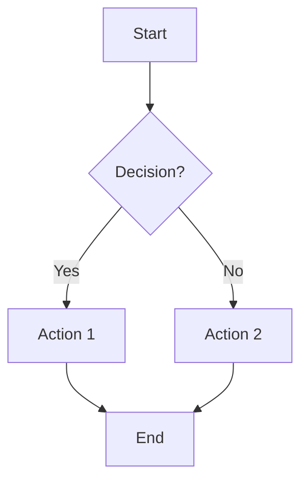
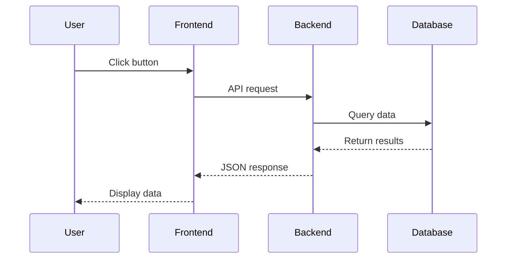
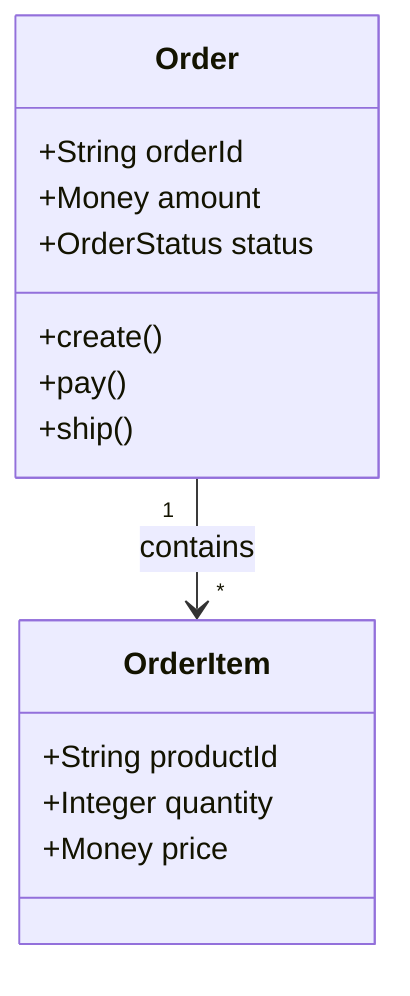
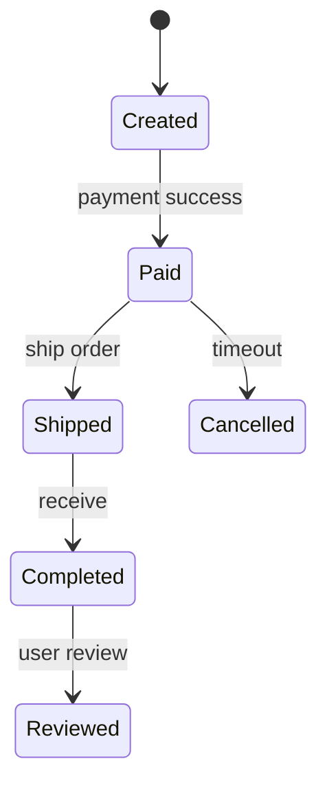
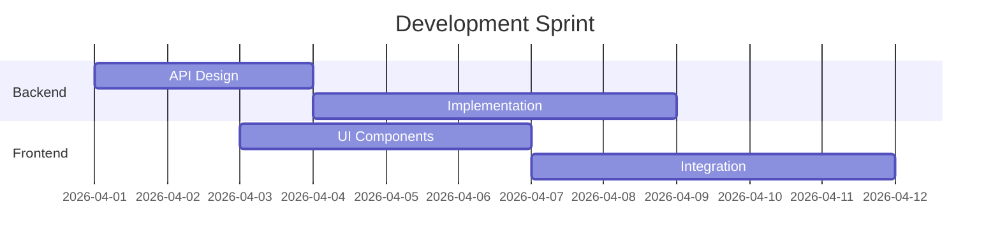
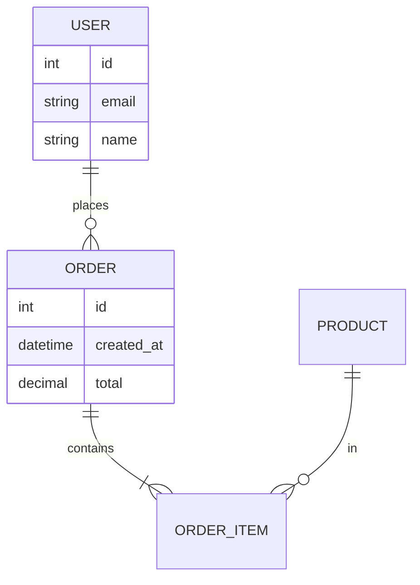

# Mermaid Diagram Guide for Learning Records

## 📊 Overview

The learning log system now supports **Mermaid diagram visualization** in entry details. You can add flowcharts, sequence diagrams, class diagrams, and more to make your learning records more visual and easier to understand.

---

## 🎯 Supported Diagram Types

### 1. Flowchart (流程图)
Best for: Process flows, decision trees, state machines



**Usage in record-learning:**
```json
{
  "diagram": "flowchart TD\n    A[Start] --> B{Decision?}\n    B -->|Yes| C[Action 1]\n    B -->|No| D[Action 2]"
}
```

---

### 2. Sequence Diagram (时序图)
Best for: API interactions, message flows, component communication



**Usage:**
```json
{
  "diagram": "sequenceDiagram\n    participant User\n    participant Frontend\n    User->>Frontend: Action\n    Frontend->>Backend: Request"
}
```

---

### 3. Class Diagram (类图)
Best for: OOP design, domain models, architecture



---

### 4. State Diagram (状态图)
Best for: State machines, lifecycle management



---

### 5. Gantt Chart (甘特图)
Best for: Project timelines, sprint planning



---

### 6. Entity Relationship (ER图)
Best for: Database schema, data modeling



---

## 💡 Best Practices

### 1. Keep It Simple
- Use clear node labels
- Limit to 10-15 nodes for readability
- Focus on key concepts, not every detail

### 2. Use Direction Wisely
- `TD` (Top-Down): Most common, good for processes
- `LR` (Left-Right): Good for timelines
- `RL` (Right-Left): Reverse flows
- `BT` (Bottom-Top): Rarely used

### 3. Add Meaningful Labels
```mermaid
# Good
A[Create Order] --> B{Payment Valid?}
B -->|Yes| C[Process Payment]
B -->|No| D[Show Error]

# Bad
A --> B
B -->|Y| C
B -->|N| D
```

### 4. Escape Special Characters
In JSON strings, escape special characters:
- `\n` for newlines
- `\"` for quotes
- `\\` for backslashes

Example:
```json
{
  "diagram": "flowchart TD\n    A[\"Step 1\"] --> B[\"Step 2\"]"
}
```

---

## 🔧 Troubleshooting

### Diagram Not Rendering?

1. **Check Syntax**: Validate at [Mermaid Live Editor](https://mermaid.live/)
2. **Escape Properly**: Ensure newlines are `\n` in JSON
3. **View Raw Code**: Click "Show raw Mermaid code" in error message

### Common Errors

**Error: "Parse error"**
- Check for missing brackets or arrows
- Verify node IDs don't have spaces (use underscores)

**Error: "Cyclic dependency"**
- Remove circular references in flowcharts
- Use subgraphs to organize complex diagrams

**Diagram Too Large**
- Split into multiple smaller diagrams
- Use subgraphs to group related nodes

---

## 📝 Example: Complete Learning Entry

```json
{
  "topic": "订单支付流程",
  "question": "如何实现分布式事务保证订单和库存一致性？",
  "insight": "使用 Saga 模式处理分布式事务，通过补偿机制保证最终一致性。",
  "diagram": "sequenceDiagram\n    participant Order as Order Service\n    participant Inventory as Inventory Service\n    participant Payment as Payment Service\n    \n    Order->>Inventory: Reserve stock\n    Inventory-->>Order: Reserved\n    Order->>Payment: Charge payment\n    Payment-->>Order: Charged\n    Order->>Inventory: Confirm reservation\n    \n    Note over Order,Payment: If payment fails:\n    Payment-->>Order: Failed\n    Order->>Inventory: Cancel reservation",
  "category": "architecture",
  "tags": ["distributed-systems", "saga-pattern", "consistency"],
  "project_module": "s-pay-mall-domain",
  "difficulty": "hard"
}
```

---

## 🚀 Quick Start

1. **Design your diagram** at [Mermaid Live Editor](https://mermaid.live/)
2. **Copy the Mermaid code** from the editor
3. **Convert to JSON string** (replace newlines with `\n`)
4. **Add to learning entry** via `/record-learning` skill
5. **View rendered diagram** in the detail modal

---

## 📚 Resources

- [Mermaid Official Docs](https://mermaid.js.org/)
- [Mermaid Live Editor](https://mermaid.live/) - Test diagrams online
- [Mermaid Cheatsheet](https://mermaid.js.org/intro/syntax-reference.html)

---

**Happy Diagramming! 📊✨**
