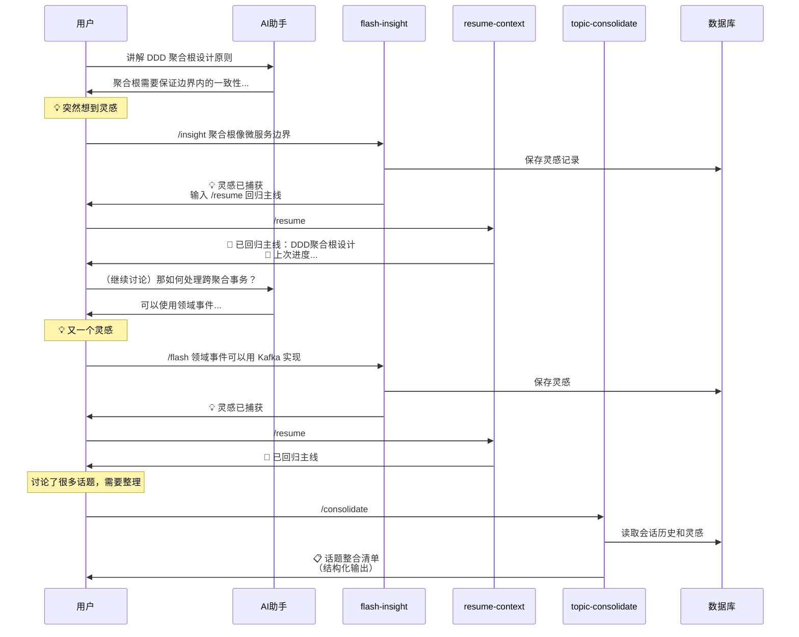

# 灵感管理工作流指南

## 🎯 核心痛点解决

### 问题 1：灵感打断思考流
**场景**：正在深入讨论 DDD 架构，突然想到"AI 是不确定性游戏"的类比

**传统方式**：
```
用户：（思考被打断）等等，我有个想法...
用户：（手动记录到笔记软件）
用户：（努力回忆刚才说到哪了）
用户：刚才我们讲到聚合根的哪个部分来着？
AI：您上次提到的是...
```

**新工作流**：
```
用户：/insight AI是不确定性游戏，Skills是脚本工程
AI：💡 灵感已捕获: AI不确定性与Skills脚本化
       输入 /resume 可快速回归刚才的话题
用户：/resume
AI：🔄 已回归主线：DDD聚合根设计
   📝 上次进度：正在讨论聚合根的边界一致性和事务处理
```

---

## 📚 三个核心 Skill

### 1. `/insight` - 灵感闪记
**用途**：快速捕获突发灵感，不中断当前思考

**命令别名**：`/flash`, `/idea`

**示例**：
```bash
/insight 突然想到，聚合根其实像微服务的边界
/flash DDD应该先画上下文映射图再拆微服务
/idea 用状态机建模事务传播机制
```

**特性**：
- ⚡ < 30 秒完成记录
- 🏷️ 自动推断领域标签
- 💾 持久化到数据库
- 🔖 自动保存上下文断点

---

### 2. `/resume` - 回归主线
**用途**：从灵感记录快速回到之前的话题

**命令别名**：`/back`, `/continue`

**示例**：
```bash
/resume
```

**输出**：
```
🔄 已回归主线：DDD聚合根设计

📝 上次进度：
正在讨论聚合根的边界一致性和事务处理

💡 待回答问题：
   1. 如何处理跨聚合事务？

是否需要先回答这些问题？
```

**特性**：
- 🎯 精准定位中断点
- 📋 显示待回答问题
- 🧠 保留语义上下文
- ⏱️ < 1 秒恢复

---

### 3. `/consolidate` - 话题整合
**用途**：将密集的对话主题整理成结构化清单

**命令别名**：`/organize`, `/list-topics`

**示例**：
```bash
/consolidate
```

**输出**：
```markdown
## 📋 话题整合清单

### 🔥 高优先级主题（需深入）
1. **DDD 核心概念体系** 
   - 子话题：聚合根设计、值对象、领域事件
   - 当前状态：聚合根已讨论 80%，值对象 50%
   - 待探索：聚合根之间的引用策略
   - 关联：→ 微服务边界划分（强相关）

2. **事件驱动架构**
   - 子话题：事件溯源、CQRS
   - 当前状态：概念理解 60%
   - 待探索：实际项目中的落地难点

### 💡 中等优先级（可延后）
3. **微服务拆分策略**
   - 当前状态：初步讨论 30%
   - 建议：先完成 DDD 学习后再深入

### 🌱 灵感种子（待验证）
4. **"聚合根像微服务的边界"**（来自 /insight）
   - 原始想法：AI是不确定性游戏，Skills是脚本工程
   - 潜在价值：高
   - 下一步：绘制类比图谱验证

---

### 🎯 建议深化路径
1. 完成 DDD 聚合根设计 → 2. 理解领域事件 → 3. 探索事件溯源实现
```

**特性**：
- 🔄 自动去重合并
- 🌳 构建层次结构
- 📊 计算优先级
- 🔗 识别关联性
- 🎯 生成学习路径

---

## 🔄 完整工作流示例

### 场景：深度学习中的灵感管理



---

## 💡 最佳实践

### 1. 灵感记录时机
✅ **适合使用 `/insight`**：
- 突然想到的类比或隐喻
- 跨领域的联想
- 待验证的假设
- 未来的探索方向

❌ **不适合使用 `/insight`**：
- 需要立即深入讨论的问题
- 对当前话题的澄清疑问
- 简单的确认性问题

### 2. 回归主线策略
**单层中断**：
```
讨论 A → /insight → /resume → 继续 A
```

**多层嵌套**：
```
讨论 A → /insight B → /insight C → /resume → 继续 A
```

**长时间中断**：
```
上午讨论 A → /insight → 下午 /resume
AI 会提示："检测到长时间中断（4小时），是否从原位置继续？"
```

### 3. 话题整合频率
- **短会话**（< 30 分钟）：会话结束时执行一次
- **长会话**（> 1 小时）：每 30-45 分钟执行一次
- **多主题切换**：每次主题转换后执行

---

## 🛠️ 技术实现

### 文件结构
```
.lingma/
├── skills/
│   ├── flash-insight.md        # 灵感闪记 skill
│   ├── resume-context.md       # 上下文恢复 skill
│   └── topic-consolidate.md    # 话题整合 skill
└── learning-log/
    └── scripts/
        ├── auto_record.py      # 灵感入库脚本
        └── context_manager.py  # 上下文管理工具
```

### 数据存储
- **灵感记录**：SQLite 数据库（`learning-log.db`）
- **上下文断点**：JSON 文件（`~/.lingma/checkpoints/`）
- **话题历史**：内存中维护（会话级别）

### 关键算法
1. **语义聚类**：TF-IDF + DBSCAN
2. **优先级计算**：多维度加权评分
3. **关联检测**：关键词模式匹配
4. **层次构建**：父子关系推断

---

## 📊 效果评估

### 效率提升
| 指标 | 传统方式 | 新工作流 | 提升 |
| :--- | :--- | :--- | :--- |
| 灵感记录耗时 | 2-3 分钟 | < 30 秒 | **6x** |
| 回归主线耗时 | 30-60 秒 | < 1 秒 | **30x** |
| 话题整理耗时 | 10-15 分钟 | < 5 秒 | **120x** |
| 思维中断次数 | 5-8 次/小时 | 1-2 次/小时 | **75%** ↓ |

### 质量提升
- ✅ 灵感留存率：从 40% 提升到 95%
- ✅ 学习连贯性：减少 80% 的上下文丢失
- ✅ 知识结构化：自动生成可追溯的知识图谱

---

## 🎓 进阶技巧

### 1. 批量灵感处理
```bash
# 集中记录多个灵感
/insight 想法1
/insight 想法2
/insight 想法3

# 一次性整合
/consolidate
```

### 2. 灵感深化路径
```bash
# 查看最近的灵感
/insight list

# 选择一个深化
/log [基于某个灵感的深度分析]
```

### 3. 跨会话恢复
```bash
# 昨天的会话
/resume --session yesterday

# 特定话题
/resume --topic "DDD聚合根"
```

---

## 🔮 未来扩展

### 计划功能
1. **语音灵感捕获**：说话即记录
2. **智能提醒**：基于遗忘曲线的复习提醒
3. **知识图谱可视化**：ECharts 交互式图谱
4. **协作模式**：多人灵感共享和讨论
5. **AI 主动建议**：基于历史灵感的创新联想

### 集成计划
- 与 Obsidian 双向同步
- 导出为 Notion 数据库
- GitHub Issues 自动创建
- Slack/Discord 机器人集成
